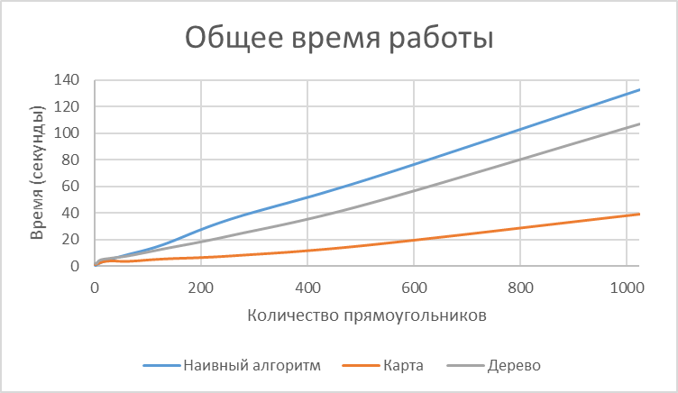
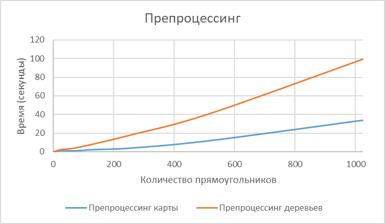

# Лабораторная работа 2

#### Задача

_На плоскости заданы двумя координатами прямоугольники, затем на вход подаются координаты точек. Необходимо за
наименьшее время отвечать, скольким прямоугольникам принадлежит данная точка._

#### Решение

В рамках лабораторной работы было проведено сравнение трех алгоритмов: наивного (brute-force), на "карте" и при помощи
персистентного дерева отрезков. Некоторые из этих алгоритмов требуют препроцессинга, первый же не требует.

## Наивный

**O(0) + O(NM)**

Наивный алгоритм предлагает для каждой новой точки проверять каждый прямоугольник и математически определять,
принадлежит ли ему точка. Данный алгоритм очень прост в реализации и при малом количестве прямоугольников вполне
приемлем, имея сложность O(NM), где N - количество прямоугольников, M - количество точек.

## Алгоритм на карте

**O(N^3) * O(1)**

### Сжатие координат

Алгоритм предполагает сжатие координат, после которого все значения по X и Y отражают только относительное расположение
прямоугольников. Такое сжатие предполагает сортировку координат за O(NlogN), а затем сопоставление сжатых координат
координатам прямоугольников - бинарным поиском позиции в отсортированном массиве (O(logN)).

### Препроцессинг

После того, как координаты сжаты и прямоугольники переведены в новую систему координат, мы можем "построить карту":
заполнить массив N*M (где N - количество уникальных координат по оси у, M - количество уникальных координат по оси х),
для каждого прямоугольника прибавляя 1 каждому элементу массива, принадлежащему прямоугольнику. Так, заполнение карты
имеет сложность O(N**3).

### Запросы

В результате такого препроцессинга ответ на запрос для любой точки происходит за O(1) (обращение к элементу двумерного
массива), однако стоит учесть, что перед ответом точка приводится к сжатой системе координат бинарным поиском (O(logN)).

## Алгоритм на персистентном дереве отрезков

**O(NlogM) * O(logM)**

### Сжатие координат

Алгоритм, так же как и предыдущий, предполагает сжатие координат (для этого используются те же функции).

### Препроцессинг

После того, как координаты сжаты и прямоугольники переведены в новую систему координат, выполняем несколько действий:

1. Разбиваем наши прямоугольники на "события": "открытие" прямоугольника и "закрытие"; событие привязано к координате по
   х и открывает/закрывает прямоугольник на отрезке [y1, y2). Требуется также отсортировать события по х.
2. Строим персистентное дерево отрезков на основе сжатых координат по у; изначально существует лишь дерево в точке х =
   0, в котором нет прямоугольников.
3. Проходимся по всем событиям, изменяя наше "нулевое" дерево: создаем копии узлов, которые имеют пересечения с
   изменяемым отрезком; очевидно, что корневой узел также будет скопирован. Новые корневые узлы будем хранить в словаре
   в формате {"координата по х": <корень дерева после данного ивента>}.

Общая сложность такого препроцессинга составит O(NlogM) - построение N деревьев отрезков.

### Запросы

После такого препроцессинга ответ на запрос будет заключаться в приведении точки к сжатым координатам посредством
бинарного поиска, а затем поиске в словаре корня по ключу х, в найденном дереве узла на отрезке [у, у].

Таким образом, ответ на запрос осуществится приблизительно за O(logN) (поиск в дереве).

## Время работы

_Сырые данные можно посмотреть в файле lab2_measures.txt._

**Особенности тестов**

- Замеры времени работы были произведены отдельно для препроцессинга и ответа на запрос для последних двух алгоритмов.
- Во всех тестах используется набор из 1000 точек, использована генерация, при которой прямоугольники оказываются
  вложенными друг в друга.
- Время было зафиксировано в секундах.

На основании приведенных графиков можно заметить, что алгоритм на карте не демонстрирует сложность O(N^3), несмотря на
то, что
она очевидно присутствует в коде. Данное обстоятельство максимально обескураживает меня, так как данный код прошел
контест и на случайно сгенерированных тестах совпадал с результатами наивного поиска и дерева.

Я могу предположить, что такой результат получается либо в результате некорректного измерения времени, либо
особенностями языка Python, многие встроенные функции которого реализованы при помощи компилируемых языков (а именно,
C++). Таким образом, дерево, большая часть функций для которого реализована с нуля на Python, уступает в
производительности карте, которая оказывается быстрее благодаря возможностям языка.

_Более точное выяснение причин некорректности графиков будет здесь._

### Причины некоорректности графиков

После тщательного анализа алгоритмов, непосредственно их кода и кода генерации мной были выявлены три основные причины,
по которым результаты замеров оказались неутешительными.

1. В генерации прямоугольников (и точек) была найдена досадная ошибка: несмотря на то, что максимальное количество точек
   и прямоугольников изменялось в течение замеров, при генерации использовалась маленькая константа, установленная для
   ручных тестов. Такое обстоятельство приводило к тому, что координаты части прямоугольников не были положительными, а
   значит, алгоритм на карте работал некорректно, не говоря уже о дереве.
   
   Так стали выглядеть замеры на алгоритмах после изменения генерации на правильную, и обнажились проблемы в
   эффективности работы алгоритма на дереве: он демонстрировал рост, близкий к O(N^3), как и алгоритм на карте.
2. В работе над оптимизацией алгоритма на дереве мной прежде всего было принято решение изменить хранение множества
   корней персистентного дерева: перенести их из словаря в массив. Так как в Python 3 словари особым образом
   упорядочены, добавление нового элемента в них гораздо менее эффективно, чем O(1), так как каждый раз требует
   упорядочивания.
3. После того, как персистентность была реализована на массиве, было выявлено, что мой алгоритм пренебрегает главным
   преимуществом дерева отрезков: работать на *отрезке*, а не в каждом конкретном листе. Таким образом, требовалось
   убрать копирование узла дерева со всеми его детьми:
    - узел копируется с изменением *модификатора*, если он полностью принадлежит изменяемому отрезку, его дочерние узлы
      не копируются;
    - узел копируется без изменения *модификатора*, если он принадлежит отрезку частично, его дочерние элементы
      копируются;
    - в остальных случаях узел не копируется.

После указанных изменений и исправлений алгоритм на карте стал демонстрировать кубическую скорость роста от количества
входных данных, а дерево отрезков стало ощутимо эффективнее, чем "наивный" алгоритм, как и ожидалось аналитически.

*Сырые данные обновленных алгоритмов и генерации можно увидеть в файле lab2_measures_updated.txt.*
Мной было принято решение не замерять на обновленных алгоритмах время препроцессинга и ответа на запросы раздельно.

## Выводы

**Наивный алгоритм** прост для понимания и реализации, демонстрирует неплохую эффективность, на большом количестве
прямоугольников обгоняя алгоритм на карте. Кроме того, данный алгоритм, безусловно, наиболее эффективен по памяти из
всех трех и совсем не требует препроцессинга.

В то же время, оставаясь интуитивно понятным, **алгоритм на карте** демонстрирует лучшую производительность в условиях
небольшого количества прямоугольников и большого количества точек, однако кубический рост сложности препроцессинга при
увеличении количества прямоугольников заставляет его быть даже менее выгодным в таких условиях, чем наивный алгоритм.

**Алгоритм на персистентном дереве отрезков** иллюстрирует максимально красивую идею, однако оказался очень сложным для
понимания и реализации и, конечно, имеет высокую сложность по памяти, из-за которой иногда может быть менее выгодным,
чем оба предыдущих варианта. Несмотря на эти минусы, по сложности данный алгоритм ощутимо лучше алгоритма на карте и
brute-force.

*Мне также очень понравилась идея сжатия координат, которая одновременно очень простая и интуитивно понятная, при этом
значительно сокращающая сложность работы алгоритмов в данной задаче.*