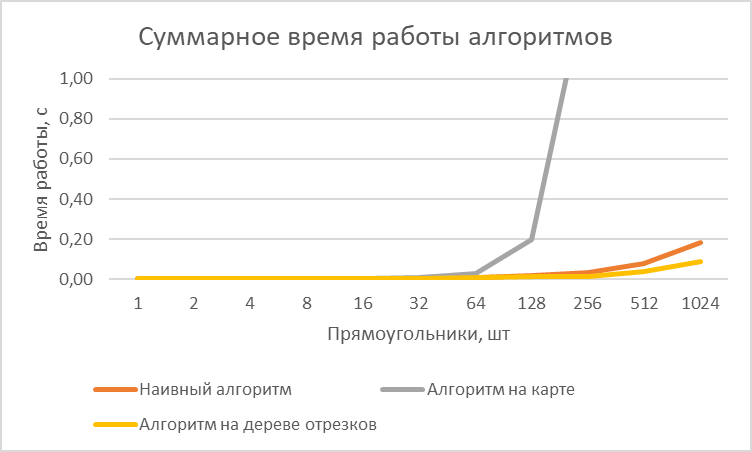

# Лабораторная работа 2

#### Задача

_На плоскости заданы двумя координатами прямоугольники, затем на вход подаются координаты точек. Необходимо за
наименьшее время отвечать, скольким прямоугольникам принадлежит данная точка._

#### Решение

В рамках лабораторной работы было проведено сравнение трех алгоритмов: наивного (brute-force), на "карте" и при помощи
персистентного дерева отрезков. Некоторые из этих алгоритмов требуют препроцессинга, первый же не требует.

## Наивный

**O(0) + O(NM)**

Наивный алгоритм предлагает для каждой новой точки проверять каждый прямоугольник и математически определять,
принадлежит ли ему точка. Данный алгоритм очень прост в реализации и при малом количестве прямоугольников вполне
приемлем, имея сложность O(NM), где N - количество прямоугольников, M - количество точек.

## Алгоритм на карте

**O(N^3) * O(1)**

### Сжатие координат

Алгоритм предполагает сжатие координат, после которого все значения по X и Y отражают только относительное расположение
прямоугольников. Такое сжатие предполагает сортировку координат за O(NlogN), а затем сопоставление сжатых координат
координатам прямоугольников - бинарным поиском позиции в отсортированном массиве (O(logN)).

### Препроцессинг

После того, как координаты сжаты и прямоугольники переведены в новую систему координат, мы можем "построить карту":
заполнить массив N*M (где N - количество уникальных координат по оси У, M - количество уникальных координат по оси Х),
для каждого прямоугольника прибавляя 1 каждому элементу массива, принадлежащему прямоугольнику. Так, заполнение карты
имеет сложность O(N^3).

### Запросы

В результате такого препроцессинга ответ на запрос для любой точки происходит за O(1) (обращение к элементу двумерного
массива), однако стоит учесть, что перед ответом точка приводится к сжатой системе координат бинарным поиском (O(logN)).

## Алгоритм на персистентном дереве отрезков

**O(NlogM) * O(logM)**

### Сжатие координат

Алгоритм, так же как и предыдущий, предполагает сжатие координат (для этого используются те же функции).

### Препроцессинг

После того, как координаты сжаты и прямоугольники переведены в новую систему координат, выполняем несколько действий:

1. Разбиваем наши прямоугольники на "события": "открытие" прямоугольника и "закрытие"; событие привязано к координате по
   Х и "открывает"/"закрывает" прямоугольник на отрезке [y1, y2). Требуется также отсортировать события по Х.
2. Строим персистентное дерево отрезков на основе сжатых координат по оси У; изначально существует лишь дерево в точке
   х = 0, в котором нет прямоугольников.
3. Проходимся по всем событиям, изменяя наше "нулевое" дерево и создавая копию изменяемого корневого узла. Новые
   корневые узлы будем хранить в массиве, где индекс элемента будет обозначать координату по Х.
4. При обработке события и изменении дерева важно воспользоваться главным преимуществом дерева
   отрезков: работать на *отрезке*, а не в каждом конкретном листе. Правила, по которым происходит обработка событий:
    - узел копируется с изменением *модификатора*, если он полностью принадлежит изменяемому отрезку, его дочерние узлы
      не копируются;
    - узел копируется без изменения *модификатора*, если он принадлежит отрезку частично, его дочерние элементы
      копируются;
    - в остальных случаях узел не копируется.

Общая сложность такого препроцессинга составит O(NlogM) - построение N деревьев отрезков.

### Запросы

После такого препроцессинга ответ на запрос будет заключаться в приведении точки к сжатым координатам посредством
бинарного поиска, а затем поиске в массиве элемента с индексом Х, в найденном дереве - поиске узла на отрезке [у, у] и
суммированием модификаторов всех узлов, входящих в найденный путь, во время выхода из рекурсии.

Таким образом, ответ на запрос осуществится приблизительно за O(logN) (поиск в дереве).

## Время работы

_Сырые данные можно посмотреть в файле lab2_measures_updated.txt._

**Особенности тестов**

- Замеры времени работы были произведены без разделения на время препроцессинга и время ответа на запрос;
- Во всех тестах используется набор из 1024 точек, использована генерация, при которой прямоугольники оказываются
  вложенными друг в друга;
- Время было зафиксировано в секундах;
- Для всех алгоритмов было замерено среднее время среди 100 запусков (исключая алгоритм на карте: для него на больших
  количествах прямоугольников запуски производились только 5 раз).

### Возникшие проблемы

Первоначально мой алгоритм на дереве отрезков не давал лучшую производительность, чем наивный: его время работы
стремилось к *O(N^3)*.

Я исправила это двумя изменениями.

- Во-первых, перенесла хранение корней дерева из словаря в
  массив: так как в Python 3 словари особым образом упорядочены, добавление нового элемента в них гораздо менее
  эффективно, чем O(1), так как каждый раз требует упорядочивания.
- Во-вторых, изменила хранение копий дерева: в
  исходном варианте я копировала всех детей измененных узлов дерева, что занимало огромное количество памяти и при этом
  давало сильнейшую просадку в эффективности алгоритма.

После того, как оба этих обстоятельства были исправлены, алгоритм на дереве отрезков даже превзошел мои ожидания по
производительности, показав существенное преимущество перед наивным алгоритмом.

## Выводы

**Наивный алгоритм** прост для понимания и реализации, демонстрирует неплохую эффективность, на большом количестве
прямоугольников обгоняя алгоритм на карте. Кроме того, данный алгоритм, безусловно, наиболее эффективен по памяти из
всех трех и совсем не требует препроцессинга.

В то же время, оставаясь интуитивно понятным, **алгоритм на карте** демонстрирует лучшую производительность в условиях
небольшого количества прямоугольников и большого количества точек, однако кубический рост сложности препроцессинга при
увеличении количества прямоугольников заставляет его быть даже менее выгодным в таких условиях, чем наивный алгоритм.

**Алгоритм на персистентном дереве отрезков** иллюстрирует максимально красивую идею, однако оказался очень сложным для
понимания и реализации и, конечно, имеет высокую сложность по памяти, из-за которой иногда может быть менее выгодным,
чем оба предыдущих варианта. Несмотря на эти минусы, по сложности данный алгоритм ощутимо лучше алгоритма на карте и
brute-force.

*Мне также очень понравилась идея сжатия координат, которая одновременно очень простая и интуитивно понятная, при этом
значительно сокращающая сложность работы алгоритмов в данной задаче.*